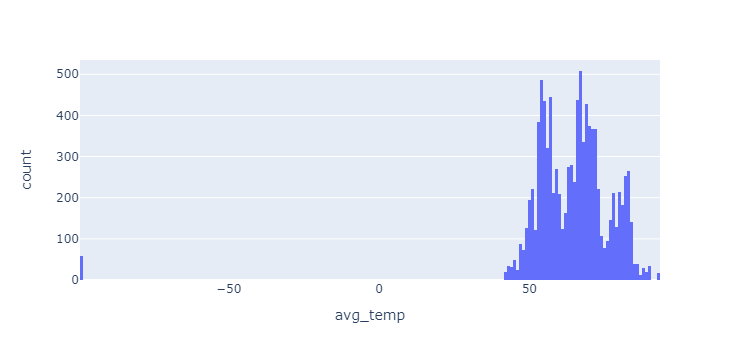
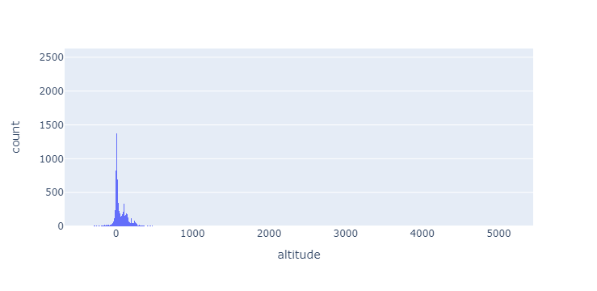
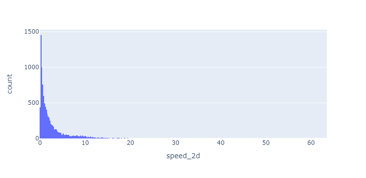

# Milestone Project 2: Traveler Profiles for Bird Watchers

## Background
*Wings 4 Life* is a bird refuge organization that helps bird watchers plan bird-watching trips along migration routes on the southwestern coast of Europe and northwestern coast of Africa.

It provides three-different travel packages for tourists to choose from based on the locations they wish to visit and the types of birds they would like to see.

## Objectives
* Join the two data tables bird_data and city_weather using SQL
* Clean/Wrangle the joined data table and perform basic Exploratory Data Analysis (EDA) on numeric and categorical features.
* Build dashboards for each of the traveler profiles for travelers to plan their trips for bird watching.

**The French Traveler**
* Only visits locations within or very near France
* Prefers high-speed bird sightings
* Hates cold weather

**The Retirement Getaway**
* Prefers to travel in the spring months
* Prefers birds that fly al low altitudes
* Willing to visit any location with mild weather (60s-70s)

**The Loner**
* Prefers the early morning
* Likes cool weather
* Looking for higher-altitude bird flights 

## Tools/Data Used
* For Data Wrangling/Cleaning and EDA:
 
* For creating dashboards:

* City Weather Data: [city_weather.sql](city_weather.sql)
* Bird Tracking Data: [bird_data.sql](bird_data.sql) 

## Exploratory Data Analysis
### For numeric features:

#### Notes on the above histograms:
* The **avg_temp** column has an outlier below 40 degrees Fahrenheit (this outlier is deleted by created a new dataframe)
* At least 15% of the altitude values are less than zero
* The **speed_2d** data is heavily right-skewed

### For categorical features:
* Most of the observations in the dataset were nearest to the city of **Dakar** (in the country of Senegal)
* Country with the *highest* average temperature is **Morocco.**
* Country with the *lowest* averager temperature is **Guinea-Bissau.**

## Traveler Profile Dashboards
The following dashboards below can be viewed on Tableau Public by clicking on the following link: [Bird Traveler Profile Dashboards](https://public.tableau.com/views/TravelerProfilesforBirdWatchers/TheLoner?:language=en-US&publish=yes&:display_count=n&:origin=viz_share_link) 

**The French Traveler**
 
**The Retirement Getaway**
 
**The Loner** 

