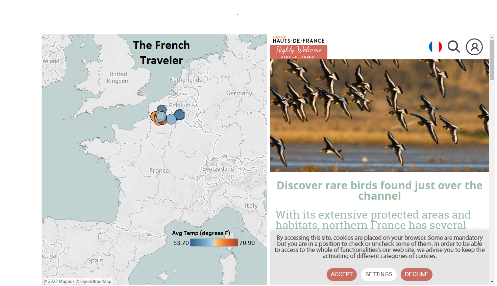
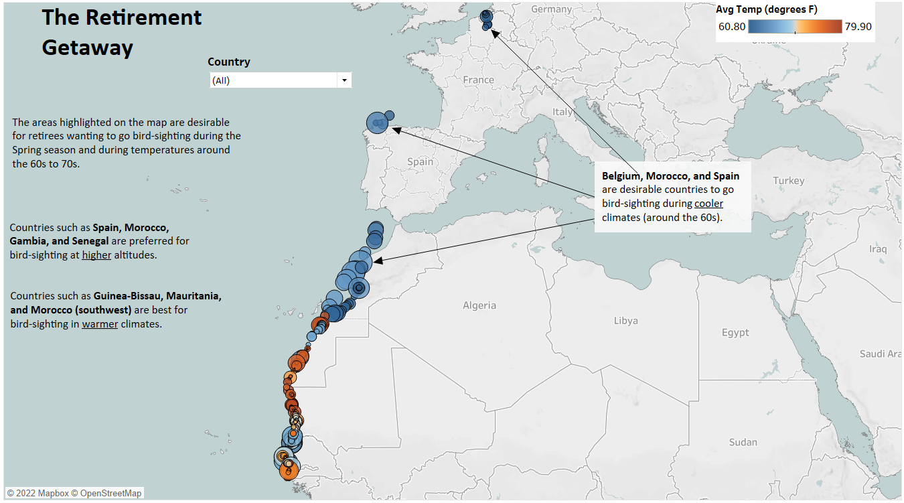

# Milestone Project 2: Traveler Profiles for Bird Watchers

## Background

*Wings 4 Life* is a bird refuge organization that helps bird watchers plan bird-watching trips along migration routes on the southwestern coast of Europe and northwestern coast of Africa.

It provides three-different travel packages for tourists to choose from based on the locations they wish to visit and the types of birds they would like to see.

## Objectives

* Create a new dataset, using SQL and Python, by joining the two data tables bird_data and city_weather.
* Cleaning the joined data table and perform basic Exploratory Data Analysis (EDA) on numeric and categorical features.
* Build dashboards for each of the traveler profiles for travelers to plan their trips for bird watching.

**The French Traveler**

* Only visits locations within or very near France
* Prefers high-speed bird sightings
* Hates cold weather

**The Retirement Getaway**

* Prefers to travel in the spring months
* Prefers birds that fly al low altitudes
* Willing to visit any location with mild weather (60s-70s)

**The Loner**

* Prefers the early morning
* Likes cool weather
* Looking for higher-altitude bird flights

## Tools/Data Used

* For writing SQL queires and accessing MySQL database: 

* For Data Wrangling/Cleaning and EDA:

* For creating dashboards: 
* City Weather Data: [city_weather.sql](https://github.com/collinbashore/data-science-and-analytics-portfolio/blob/main/Milestone%20Project%202/city_weather.sql)
* Bird Tracking Data: [bird_data.sql](https://github.com/collinbashore/data-science-and-analytics-portfolio/blob/main/Milestone%20Project%202/bird_data.sql)

## Exploratory Data Analysis

### For numeric features

#### Notes on the above histograms

* The **avg_temp** column has an outlier below 40 degrees Fahrenheit (this outlier is deleted by created a new dataframe)
* At least 15% of the altitude values are *less than* zero
* The **speed_2d** data is heavily right-skewed

### For categorical features

* Most of the observations in the dataset were nearest to the city of **Dakar** (in the country of Senegal)
* Country with the *lowest* average temperature is **Morocco.**
* Country with the *highest* averager temperature is **Guinea-Bissau.**

## Traveler Profile Dashboards

The following dashboards below can be viewed on Tableau Public by clicking on the following link: [Bird Traveler Profile Dashboards](https://public.tableau.com/views/TravelerProfilesforBirdWatchers/TheLoner?:language=en-US&publish=yes&:display_count=n&:origin=viz_share_link)

**The French Traveler**

**The Retirement Getaway**

**The Loner**

