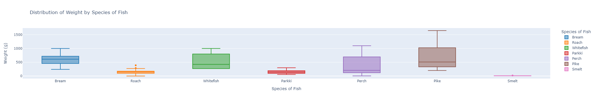
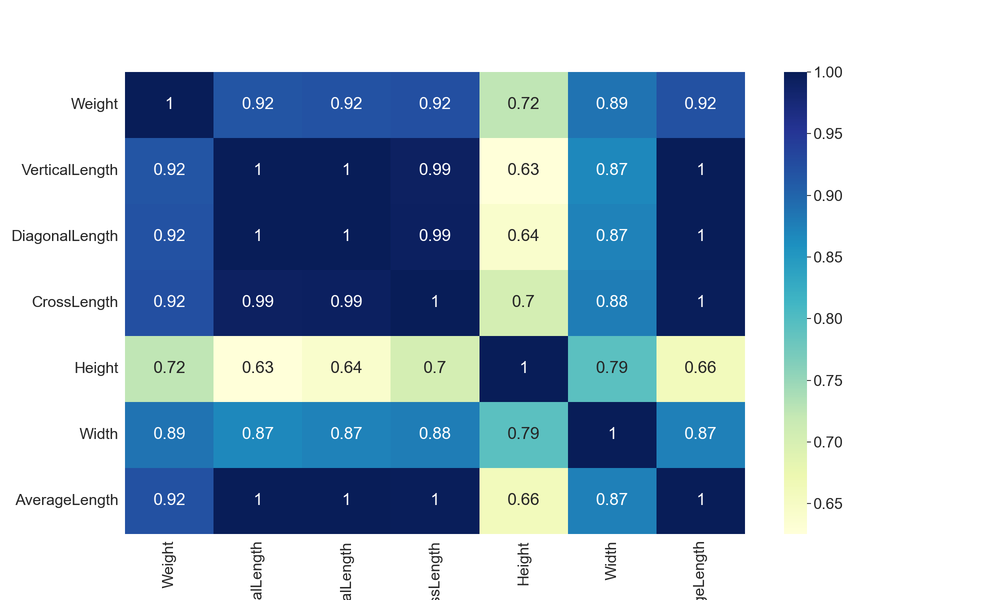

# Project: Exploratory Data Analysis (EDA) and Multivariate Regression Analysis of the Fish Market

## Objectives:
* Determine how the fishes should be distributed by species and weight.
* Perform multivariate regression analysis to predict the average weight (cm) of all fish in the fish market.
* Determine the relationship between the Average Length (cm) ad the Weight (g) of all fish by species.

## Exploratory Data Analysis

### Note on the Plotly Plots:

To interact with the plotly plots created in this project, you can go to the project notebook or interact with the plots
linked here individually:

* [Weight vs. Average Length]("avglength_vs_weight.html")
* [Height vs. Species]("height_vs_species.html")
* [Weight vs. Species]("weight_vs_species.html")
* [Width vs. Species]("width_vs_species.html")

## Multivariate Regression Analysis

#### Notes on Regression Output:

$\hat y$ = -499.5870 + 62.3552$x_1$ - 6.5268$x_2$ - 29.0262$x_3$ + 28.2974$x_4$ + 22.4733$x_5$ 

* Since the p-value of the F-statistic of 4.95e-70 is **less than** the significane level of 0.05, the above model is assumed to be statistically significant 
* 88.5% of the variation of Weight can be explained by the predictor variables

## Project Conclusion:
* Based on the EDA of the fish market, it is best to decrease the Pike fish species placed in each fish tank to prevent from the fish tanks collapsing since the Pike species have the largest average length and has few fishes that are heavier in weight.
* Bream and Whitefish fish species should also be carefully place in each of the fish tanks since their average weights are a bit higher compared to other fish species.
* There is a strong positive association between Weight and Average Length of Fish (r = 0.92)

### Project Notebook can be accessed here: [Project Notebook]("FIshMarketEDA.ipynb")